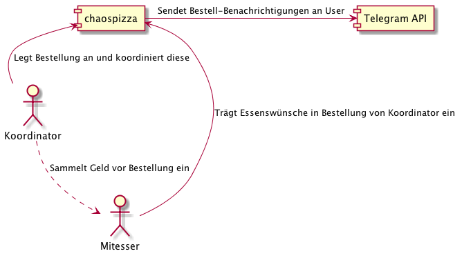

# chaospizza

This project contains a django web project which provides the main order
functionality for chaospizza.  

The application provides a web UI to announce food delivery orders.  You'll
announce a new order, tell other people to add their requests (or they get
notified).  At some point the order is made, food is delivered, people pay, etc
etc. There are also status updates and deadlines for orders.  

# System Context Diagram

## Local development environment

Python 3.6.1 is required and should be installed in a new virtualenv named
`chaospizza-3.6.1`.  The project contains a `.python-version` file so the
virtualenv is activated automatically (when pyenv is configured correctly).  

TODO: docker-compose

A `Makefile` is provided which automates most development tasks.  

Install all dependencies in the current virtualenv:  

    $ make install

Run the django development server:  

    $ make run

Before the server is started, linters, tests, and migrations are run.  

The django application is available at `http://localhost:8000`  

The django admin is available at `http://localhost:8000/admin/`  

TODO: Automatic admin user creation  

## Environment variables

The django application requires a set of environment variables to be
configured.  In development, those can be set by placing an `.env` file in the
project root containing `key=value` pairs.  

**The following variables are available:**

- `DJANGO_DATABASE_URL`: URL to postgres database (required)

- `DJANGO_EMAIL_BACKEND`: Set to `django.core.mail.backends.console.EmailBackend`
to disable SMTP delivery (optional)

- `DJANGO_EMAIL_URL` Mailserver used to send mails (required)

- `DJANGO_EMAIL_SUBJECT_PREFIX`: Prefix of emails sent, default: `[chaospizza]`

- `DJANGO_DEFAULT_FROM_EMAIL`: Default: `chaospizza <noreply@pizza.chaosdorf.de>`

**Only needed in production:**

- `DJANGO_SECRET_KEY`: Secret key for cryptographic signing (required)

- `DJANGO_ALLOWED_HOSTS`: Public http hostname of the site (required)

- `DJANGO_STATIC_ROOT`: Directory where static files are stored for serving

- `DJANGO_STATIC_URL`: URL prefix under which static files are served

## Vagrant VM

There is a Vagrantfile which provides a simple ubuntu VM with of Postgres 9.6.  

# License

The MIT License (MIT)

Copyright (c) 2017 Chaosdorf e.V.

Permission is hereby granted, free of charge, to any person obtaining a copy of this software and associated documentation files (the "Software"), to deal in the Software without restriction, including without limitation the rights to use, copy, modify, merge, publish, distribute, sublicense, and/or sell copies of the Software, and to permit persons to whom the Software is furnished to do so, subject to the following conditions:

The above copyright notice and this permission notice shall be included in all copies or substantial portions of the Software.

THE SOFTWARE IS PROVIDED "AS IS", WITHOUT WARRANTY OF ANY KIND, EXPRESS OR IMPLIED, INCLUDING BUT NOT LIMITED TO THE WARRANTIES OF MERCHANTABILITY, FITNESS FOR A PARTICULAR PURPOSE AND NONINFRINGEMENT. IN NO EVENT SHALL THE AUTHORS OR COPYRIGHT HOLDERS BE LIABLE FOR ANY CLAIM, DAMAGES OR OTHER LIABILITY, WHETHER IN AN ACTION OF CONTRACT, TORT OR OTHERWISE, ARISING FROM, OUT OF OR IN CONNECTION WITH THE SOFTWARE OR THE USE OR OTHER DEALINGS IN THE SOFTWARE.
